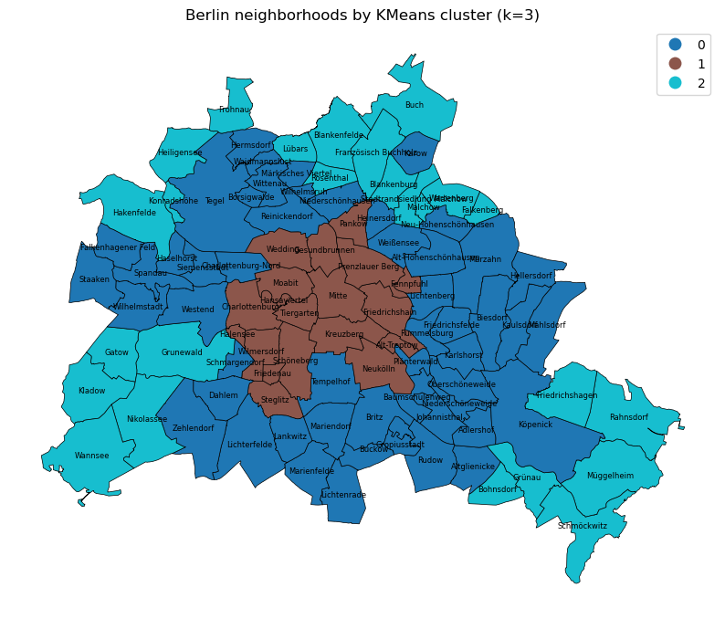
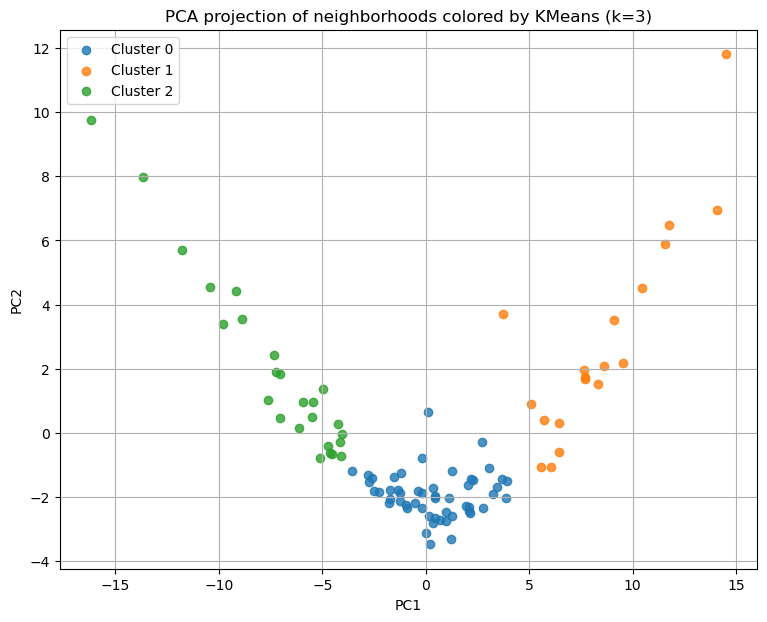
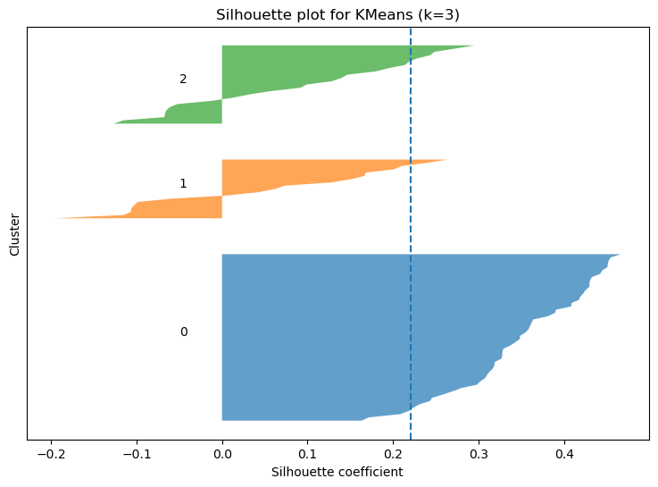

# Berlin neighborhood clustering

## TL;DR

This project transforms raw Berlin amenity and infrastructure layers into an interpretable neighborhood-level feature table and uses it to uncover urban structure through clustering.

The workflow moves from raw counts to normalized and spatially meaningful features:

- spatial density (`per sq km`)
- population density (`per 1,000 residents`)
- area shares (parks, playgrounds, protection zones)
- proximity metrics (distance to nearest 1 / 3 / 5 amenities)
- accessibility ratio

The resulting feature space is used for:

- K-means clustering and PCA-based exploration  
- identification of neighborhood typologies (central, intermediate, peripheral)  
- user-intent weighting (family, nightlife, transport, composite scenarios)  

This allows the model to move beyond static clustering toward **preference-aware neighborhood similarity**.

Clustering and user-intent modeling logic are partially modularized into reusable Python modules.

---

## Results at a glance

The analysis reveals a clear structure in Berlin’s neighborhood space:

- baseline clustering (k = 3) separates central, intermediate, and peripheral neighborhoods
- nightlife is the strongest structural signal, isolating a compact urban core
- transport reinforces an existing accessibility gradient rather than reshaping it
- family-related features act as a filter rather than a primary segmentation axis
- combined user preferences produce realistic, multi-criteria neighborhood groupings

These results show how clustering can move from exploratory analysis toward preference-aware neighborhood recommendation.

---

## Example outputs

### K-means clustering (k = 3)



The baseline clustering reveals a strong spatial structure, separating central neighborhoods from intermediate and peripheral areas.

---

### PCA projection of neighborhood feature space



The PCA projection shows clear separation between clusters, indicating that the feature space captures meaningful differences in neighborhood structure.

---

### Silhouette analysis



The silhouette plot confirms good separation for the k = 3 solution, with most neighborhoods assigned to well-defined clusters.

---

## Project structure

The repository is organized to separate raw data inputs, SQL feature generation, notebook-based exploration, and future production code.

```text
berlin-neighborhood-clustering/
│
├── assets/
│   ├── kmeans_clusters_map.png
│   ├── pca_projection.png
│   └── silhouette_plot.png
│
├── data/
│   ├── neighborhood_features_clustered.csv
│   ├── neighborhood_features_counts.csv
│   ├── neighborhood_features_exploration.csv
│   └── population_data.csv
│
├── notebooks/
│   ├── 01_data_exploration.ipynb
│   └── 02_neighborhood_clustering_analysis.ipynb
│
├── sql/
│   ├── create_neighborhood_amenity_counts.sql
│   └── create_neighborhood_proximity_features.sql
│
├── src/
│   ├── __init__.py
│   ├── clustering.py
│   ├── weighting.py
│   └── scoring.py
│
├── .gitignore
└── README.md
```

### Folder and file overview

#### Root-level data files

- `neighborhood_features_counts.csv`  
  Intermediate output containing neighborhood-level raw amenity counts and selected structured signals.

- `neighborhood_features_exploration.csv`  
  Final feature table after density, share, population-normalized, and proximity transformations.

- `population_data.csv`  
  Population data imported from Berlin open data and used for per-capita normalization.

---

#### `notebooks/`

Contains exploratory workflows and interpretation.

- `01_data_exploration.ipynb`  
  - loads SQL outputs  
  - performs feature engineering and normalization  
  - explores correlations and data quality  
  - exports the final modeling-ready feature table  

- `02_clustering.ipynb`  
  - performs clustering analysis (K-means, PCA)  
  - evaluates cluster quality  
  - interprets neighborhood typologies  
  - explores user-intent weighting scenarios  

The notebooks remain the primary interface for exploration and interpretation.

---

#### `sql/`

Contains SQL scripts executed against PostGIS source tables.

- `create_neighborhood_amenity_counts.sql`  
  Generates raw neighborhood-level amenity counts and structured signals.

- `create_neighborhood_proximity_features.sql`  
  Generates centroid-based proximity metrics using nearest-neighbor distance logic.

---

#### `src/`

Contains reusable Python modules extracted from the clustering workflow.

The goal of this folder is to separate stable, reusable logic from notebook experimentation.

Current modules:

- `clustering.py`  
  Core clustering utilities, including:
  - K-means evaluation across k values  
  - elbow curve computation  
  - silhouette and quality metrics  
  - cluster interpretation helpers  

- `weighting.py`  
  Functions for user-intent simulation through feature weighting:
  - applying group-based feature weights  
  - weight sensitivity analysis  
  - weighted clustering diagnostics  

- `scoring.py`  
  Preference-based scoring utilities:
  - ranking clusters based on selected feature subsets  
  - identifying best-matching clusters for user profiles  

---

Feature engineering logic is intentionally **not** included in `src/`.

This is because transformations depend on feature-specific semantic decisions, such as:

- whether a signal should be modeled as raw count  
- spatial density (`per sq km`)  
- population-normalized density (`per 1,000`)  
- area share  
- or centroid-based proximity (with varying k)

These decisions are currently explored and validated in the notebook rather than abstracted into a generic pipeline.

Future iterations may progressively formalize this layer once transformation rules stabilize.

---

## Project objective

The goal of this project is to create a robust feature space describing Berlin neighborhoods.

The final dataset is designed for:

- Clustering
- PCA
- Neighborhood segmentation
- Urban typology discovery
- Downstream predictive modeling

The unit of analysis is the Berlin **Ortsteil** (neighborhood).

---

## Intended clustering perspectives

The engineered feature space is designed to support multiple neighborhood perspectives that can later be used for clustering and urban typology discovery.

These include:

- **accessibility and transport**
  - public transport stops
  - station proximity
  - bike lane infrastructure
  - walkable service access

- **family and residential services**
  - kindergartens
  - schools
  - playgrounds
  - parks
  - healthcare access

- **nightlife and social infrastructure**
  - spaetis
  - venues
  - social clubs
  - theaters
  - cinemas
  - nightlife density

- **culture and tourism**
  - galleries
  - museums
  - hotels
  - cultural venues
  - entertainment hubs

- **housing and urban pressure**
  - long-term listings
  - housing price signals
  - milieuschutz areas

These perspectives are not modeled as separate outputs, but are embedded into the feature space so that unsupervised methods can later identify latent neighborhood archetypes.

---

## Data sources

Primary source layers are stored in:

`berlin_source_data`

Additional demographic data was sourced from:

https://daten.odis-berlin.de/de/dataset/ortsteile/

For faster iteration during the proof of concept, population data was imported as a local CSV file instead of being loaded into SQL.

The file used in this project is:

```text
/data/population_data.csv
```

One data issue was identified:

- **Schlachtensee** exists as a separate neighborhood in newer administrative versions

For speed, its population was temporarily redistributed across:

- Zehlendorf
- Nikolassee

This assumption should be revisited in future versions.

---

## Feature engineering philosophy

Feature transformations follow six principles:

1. **Raw counts for initial inspection**
2. **Spatial density for infrastructure and activity layers**
3. **Population density for resident-facing services**
4. **Area shares for land-use features**
5. **Proximity from centroid to amenities**
6. **Interpretable accessibility signal**

This keeps the feature space explainable while making it suitable for clustering.

---

## Why raw counts are not suitable for modeling

Raw amenity counts were intentionally not used as final modeling features because they are structurally biased and difficult to compare across neighborhoods.

Absolute counts are influenced by multiple scale effects, including:

- neighborhood area
- population size
- degree of urbanization

This means that highly urban districts often show larger counts simply because they concentrate many amenities and activities.

At the same time, larger neighborhoods may also accumulate higher counts due to their physical extent.

As a result, raw counts mix together:

- urban intensity
- neighborhood size
- service concentration

This makes them unsuitable as direct clustering features, because the model may primarily separate neighborhoods by scale rather than by functional urban profile.

To ensure comparability and interpretability, count-based features were transformed into normalized representations such as:

- amenities per km²
- amenities per 1,000 residents
- land-use shares
- centroid-based proximity metrics

Raw counts were retained only for initial inspection and data quality checks.

---

## Data quality and scope decisions

Before feature engineering, all source layers were audited.

A major finding was the distinction between:

- structured fields
- noisy free-text fields

### Included

Examples of structured signals:

- counts
- accessibility flags
- capacities
- areas
- numeric attributes
- categorical amenity types

### Excluded

Fields such as:

- `opening_hours`
- `operating_hours`
- free-text descriptions

were intentionally excluded.

These fields were highly inconsistent and would require dedicated preprocessing.

Examples included:

- `24/7`
- `Mo-Fr 08:00-18:00`
- `see website`

These remain strong future candidates for liveliness features.

---

## Feature transformations

### Spatial density

Used for point-based urban infrastructure and activity layers.

Formula:

```python
feature_per_sq_km = feature_count / area_sq_km
```

Examples:

- bus stops
- tram stops
- doctors
- supermarkets
- nightlife venues
- schools
- universities

---

### Population density

Used for resident-facing services.

Formula:

```python
feature_per_1000 = feature_count / population * 1000
```

Examples:

- kindergarten
- school
- vocational school
- kindergarten capacity
- long-term housing listings

---

### Area share

Used for land-use features.

Formula:

```python
share = feature_area / neighborhood_area
```

Examples:

- parks
- playgrounds
- milieuschutz zones

Bike lanes were approximated as:

```python
bike_lane_length_m / sq_km
```

A road-share denominator would be preferable in future versions.

---

### Accessibility ratio

A simplified accessibility score was created as:

```python
accessible amenities / total amenities
```

This is intentionally a high-level proxy.

It should not yet be interpreted as a rigorous urban accessibility index.

---

### Proximity features

For frequent-use amenities, accessibility was modeled through distance from the neighborhood centroid.

This was preferred over density alone.

Different `k` values were used depending on amenity frequency.

#### k = 1
Rare amenities:

- hospitals
- fire stations
- police stations

#### k = 3
Medium-frequency services:

- schools
- libraries
- malls
- doctors

#### k = 5
High-frequency daily services:

- bakery
- ATM
- supermarket
- spaeti
- transport stations

This was based on exploratory tests.

For bakeries, increasing `k` had little effect on compute time but increasingly diluted locality.

This led to the final heuristic:

- `1` rare
- `3` medium
- `5` frequent

---

## SQL and notebook workflow

### SQL

Two separate SQL scripts are used:

- amenity counts
- proximity features

Simpler spatial calculations such as neighborhood area are performed in Python.

---

### Intermediate outputs

Counts are stored in:

`/data/neighborhood_features_counts.csv`

Final modeling-ready table:

`/data/neighborhood_features_exploration.csv`

---

## Data issues found during exploration

Several important issues were identified.

### ID formatting

Some neighborhood IDs were stored as:

- `123`

instead of:

- `0123`

This was corrected using zero-padding.

---

### Missing data

Issues identified and corrected:

- empty vocational school table
- incomplete schools table
- NULL hospital neighborhood IDs
- missing short-term listing IDs

---

### Tram stop anomalies

Some tram stops appeared in neighborhoods without tram infrastructure.

This strongly suggested OSM labeling issues.

These records are currently being corrected.

---

### Boundary mismatch

The Schlachtensee boundary issue remains open.

Future versions should align all sources to a single boundary definition.

---

## Correlation insights

Three clear latent urban dimensions emerged.

### 1. Healthcare and daily services

Examples:

- dental offices ↔ doctors
- pharmacies ↔ supermarkets
- kindergartens ↔ pharmacies

This likely captures:

- residential density
- daily-life convenience
- family-oriented services

---

### 2. Culture and nightlife

Examples:

- theaters ↔ venues
- galleries ↔ museums
- social clubs ↔ spaetis

This captures:

- nightlife
- tourism
- culture
- evening economy

---

### 3. Accessibility and centrality

Distance correlations reveal a strong service-access dimension.

Examples:

- bakery ↔ pharmacy
- pharmacy ↔ supermarket
- spaeti ↔ transport stations

This likely separates:

- highly walkable inner districts
- moderately connected residential zones
- peripheral neighborhoods

---

## Clustering and key findings

The engineered feature space was used to explore neighborhood structure through unsupervised learning, focusing on both baseline clustering and user-intent weighting scenarios.

### Baseline clustering

K-means clustering on the full feature space identifies a structure primarily driven by accessibility, service density, and urban centrality.

The optimal solution (`k = 3`) separates:

- highly accessible central neighborhoods  
- intermediate residential areas  
- peripheral low-access zones  

This indicates that Berlin’s neighborhood structure is largely shaped by gradients of accessibility and urban intensity.

---

### User-intent weighting

To simulate real-world decision-making, feature groups were reweighted to reflect different user priorities.

#### Family-oriented

- requires strong weighting to influence clustering  
- does not produce fine-grained segmentation  
- mainly separates accessible vs peripheral neighborhoods  

→ family-related features act as a **filter**, not a structural driver  

---

#### Nightlife-oriented

- strongly reshapes clustering even at moderate weights  
- produces a compact, clearly separated urban core  

→ nightlife is a **dominant structural dimension** in the city  

---

#### Transport-oriented

- gradually reshapes clustering while remaining aligned with the baseline  
- reveals a three-level connectivity structure:
  - transport core  
  - intermediate accessible belt  
  - peripheral low-connectivity areas  

→ transport strengthens and refines the **existing accessibility gradient**  

---

#### Composite user-intent scenario

A combined preference profile (family + transport, reduced nightlife) produces:

- a broad cluster of neighborhoods balancing accessibility and livability  
- a smaller cluster of more peripheral, lower-access areas  

→ composite weighting behaves as a **preference filter on top of the baseline structure**, rather than creating a new segmentation  

---

### Practical takeaway

Neighborhood similarity is not fixed but depends on user priorities.

- some dimensions (nightlife) create strong structural splits  
- others (family) mainly filter the existing structure  
- combined preferences produce more realistic, multi-criteria neighborhood groupings  

This shows how clustering can evolve from exploratory analysis into a foundation for user-driven recommendation systems.

---

## Future work

The current feature table provides a strong proof-of-concept foundation, but several important extensions could significantly improve modeling quality and interpretability.

---

### Move from Ortsteile to LOR units

A strong next step would be to move from **Ortsteile** to **Lebensweltlich orientierte Räume (LOR)** as the spatial unit of analysis.

Source:  
https://daten.odis-berlin.de/de/dataset/lor_bezirksregionen_2021/

LORs are smaller planning units used by Berlin’s district administrations for urban analysis and public service planning.

Compared with Ortsteile, they offer:

- finer spatial granularity
- more homogeneous population groups
- better alignment with local urban patterns

Berlin is divided into **143 Bezirksregionen (LOR units)**, each covering on average around **25,000 residents**.

Using LORs instead of Ortsteile would likely improve:

- neighborhood comparability
- clustering precision
- local accessibility analysis
- typology detection

The current Ortsteil level may still be too coarse for some urban signals, especially in mixed-use central districts.

---

### Improve bike lane normalization

Bike lanes are currently normalized as:

`bike lane length / sq km`

This is a useful first proxy, but not the ideal denominator.

A better future metric would be:

`bike lane length / total road length`

This would produce a true **bike lane share of street infrastructure**, which is more interpretable for mobility analysis.

This requires integrating a street network layer.

---

### Enrich semantic feature granularity

Several categories are currently aggregated at a high level.

Future iterations should split these into more granular semantic features.

Examples include:

- **religious institutions by denomination or religion**
  - church
  - mosque
  - synagogue
  - temple

- **schools by type**
  - primary
  - secondary
  - vocational
  - specialized schools

- **medical services by specialty**
  - general practitioners
  - pediatricians
  - dentists
  - specialists

- **venue and cultural spaces by subtype**
  - concert venues
  - cinemas
  - galleries
  - museums
  - clubs

This would allow the model to better capture neighborhood identity beyond general amenity density.

---

### Normalize temporal activity signals

Opening hours were intentionally excluded in this proof of concept.

A future step would be to normalize these fields into structured temporal features such as:

- 24/7 availability
- evening activity
- weekend availability
- late-night services

This would help capture signals such as:

- nightlife intensity
- convenience infrastructure
- neighborhood liveliness

---

### Dimensionality reduction and clustering

The current feature table has already been used as the input layer for initial unsupervised learning and neighborhood typology discovery.

K-means clustering and user-intent weighting experiments reveal that Berlin’s neighborhood structure is largely driven by:

- accessibility and transport connectivity  
- service density and urban intensity  
- specialized dimensions such as nightlife concentration  

These experiments demonstrate that clustering can capture both:

- baseline urban structure  
- and user-driven similarity through feature weighting  

However, several extensions could significantly improve interpretability and modeling depth.

Natural next steps include:

- **PCA**
  - dimensionality reduction  
  - identification of dominant latent factors  

- **UMAP / t-SNE for visualization**
  - non-linear embeddings  
  - improved understanding of cluster geometry  

- **Alternative clustering methods**
  - hierarchical clustering  
  - density-based approaches  

- **Stability and robustness analysis**
  - cluster consistency across subsamples  
  - sensitivity to feature selection  

- **Refinement of user-intent modeling**
  - continuous weighting across feature groups  
  - neighborhood-level scoring instead of cluster-level ranking  

The objective remains to identify latent neighborhood archetypes such as:

- highly connected central districts  
- family-oriented residential zones  
- nightlife and tourism hubs  
- low-density peripheral neighborhoods  

This is what we mean by **neighborhood typology discovery**:

identifying groups of neighborhoods that share similar urban characteristics based on the engineered feature space, and extending this toward user-driven similarity and recommendation.
